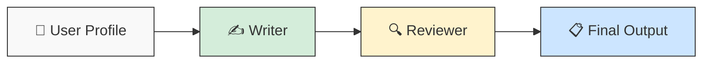

# ✍️ Resume Agent

Generates tailored resume bullet points and a cover letter for a target company and role, then reviews them through a simulated hiring manager.

## Architecture



**Writer node** — Makes two separate LLM calls: one for resume bullets, one for a cover letter paragraph. Each call uses the shared retry logic with exponential backoff.

**Reviewer node** — Acts as a senior hiring manager. Reviews both artifacts for professionalism, clarity, impact, and company-specific tone. Catches hallucinations and weak points.

## Usage

```bash
# From the repo root
cd resume_agent
python main.py
```

Make sure you've set up `personal_profile.py` at the repo root first (see [main README](../README.md)).

## Configuration

Edit `config.yaml` in this directory:

| Setting | Description | Default |
|---------|-------------|---------|
| `target.company` | Company to tailor output for | `KPMG` |
| `target.role` | Target role/function | `AI Consulting / AI Strategy` |
| `target.referral_name` | Internal referral name, or `null` to omit | `null` |
| `llm.temperature` | Lower = more factual | `0.4` |

## Roadmap

- [x] Writer + Reviewer pipeline
- [ ] Job posting scraper node
- [ ] Skills gap analyzer
- [ ] Output to file (markdown/docx)
